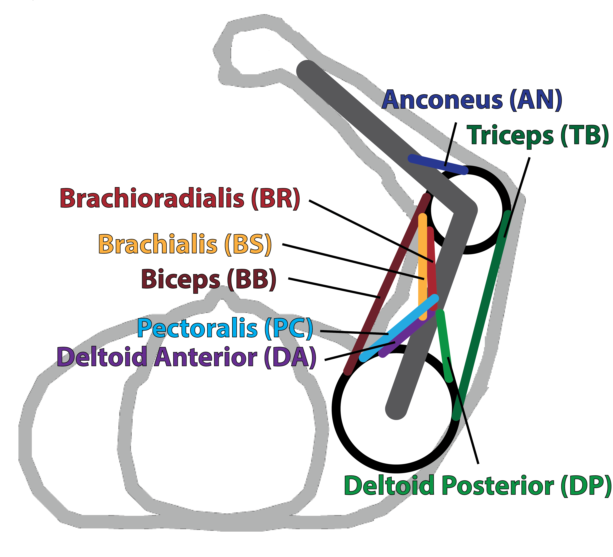

# Arm Model Simulation using 8 Muscle Actuators

This  code will allow users to quickly and easily run a simulation of a two link arm with 8 muscle actuators to estimate energetic costs or inverse dynamics. A diagram of the biomechanical model is shown below.

  

# Main files
## Example.m
A short file that shows what inputs to specify with the model and how to call the model using the funciton single_sim.m. The inputs for the function are shown below.

## single_sim.m
The main function is single_sim.m. Call this function with the inputs specified and it will run the single arm reaching simulation.

### Inputs
1. Mass added at the hand in kg. (input.added_mass)
2. Subject mass in kg. (input.subj_mass)
3. Subject height in m. (input.subj_height)
4. Movment duration of the sim. (input.movedur)
5. Normalized force parameter in Pa. (input.normforce)
6. Starting position from shoulder in m. (start_pos)
7. Relative target position in m. (tar_rel_pos)

### Outputs
This function returns all the computed variable in one data structure.
1. shoulder - Shoulder torques
2. elbow - Elbow torques
3. theta - Shoulder and elbow angles
4. muscles - Muscle forces/stress
5. act - Muscle Activations
6. u - Neural Drive to those muscles
7. est - Estimated active state from u, used for checking.
8. tnew - New time array that goes with est.
9. umber - [Umberger Energetics estimates](https://royalsocietypublishing.org/doi/10.1098/rsif.2010.0084)
10. bhar - [Bhargava Energetics estimates](https://www.sciencedirect.com/science/article/pii/S0021929003002392?casa_token=PR8Lc_kEddwAAAAA:CR5WxV07adqbaVxhwBgPTiyiyW5cC9QrlYIv5w7dEbg5Pr8o20DC5SoUbD8NaArcGhC-R62nWLY)
11. uch - [Uchida Energetics estimates](https://dx.plos.org/10.1371/journal.pone.0150378)
12. lich - [Lichtwark Energetics estimates](https://jeb.biologists.org/content/208/15/2831)
13. marg - [Margaria Energetics estimates](https://doi.org/10.1007/BF00699624)
15. eff_mass - Effective mass array.
